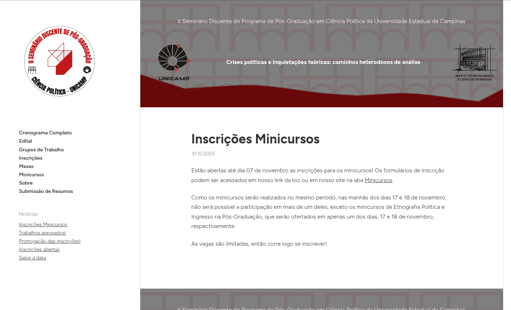
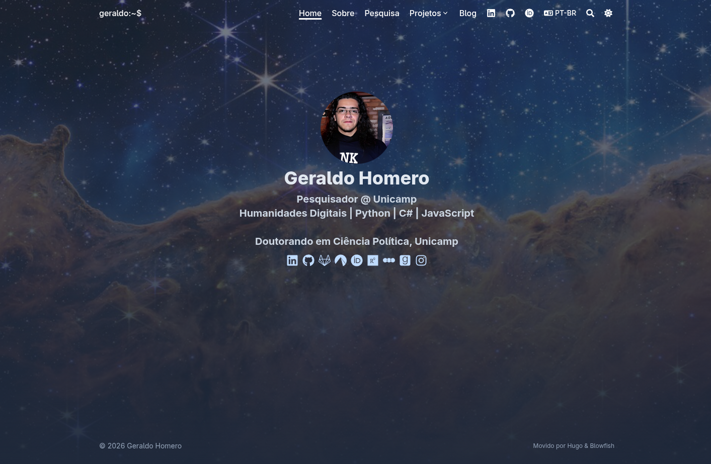

Custom academic website creation service for researchers, professors, and students. The service includes responsive design, search engine optimization (SEO), and integration with academic platforms. Ideal for highlighting publications, projects, and your curriculum in a professional and accessible way.

[Contact us](mailto:geraldohomero+universitas@pm.me) for more information and personalized quotes.

Initially, we offer three categories of services based on the ease of site maintenance, so you can choose the option that best fits your needs and management preferences:

---

### 1. Easy Maintenance
Ideal for those seeking practicality. You update the content independently through intuitive visual panels, without touching any code.

- **Technologies:** WordPress, Wix, or Squarespace.
- **Hosting:** Client's choice or based on our recommendation.
- **Included:** Design creation, initial configuration, and management training.
- **Technical Support (Optional):** Rates to be discussed.

---

### 2. Intermediate (Static)
For those familiar with technology. Ultra-fast sites using Markdown for content management and versioning via GitHub.

- **Modern Technologies:** Hugo, Astro, or Jekyll.
- **Hosting:** Highly flexible (GitHub Pages, Netlify, Vercel, etc.).
- **Included:** Repository configuration and complete tutorial for updates via Markdown.
- **Technical Support (Optional):** Rates to be discussed.

---

### 3. Advanced & Custom
Complex and tailored web solutions for research projects that require specific features, dashboards, or databases.

- **Cutting-edge Technologies:** JavaScript (React, Next.js) or C# (ASP.NET).
- **Included:** Full-stack development and 6 months of guaranteed support after implementation.
- **Additional Support (after 6 months):** Rates to be discussed.

---

> **We issue invoices** for both individuals and companies. [Contact us](mailto:geraldohomero+universitas@pm.me) for a personalized quote.

---

## Examples of Created Academic Sites

### [II Student Seminar of the Graduate Program in Political Science at Unicamp (2025)](https://seminariodiscenteppgcp.wordpress.com/)

### [Professional Academic Site](https://geraldohomero.github.io/)

